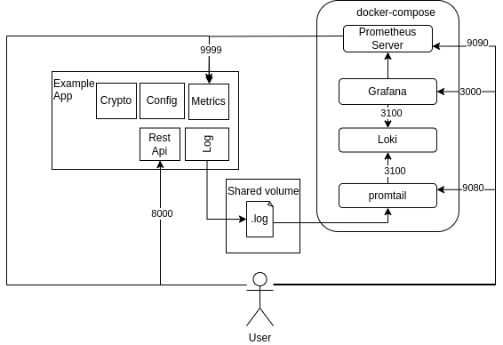

# Platform-base Example App

## Goal

A simple enough application that utilizes platform-base modules. This application serves as a testing environment for platform-base module behavior without the need for platform and services layers.
See [base](../platform-sdk/docs/base/base.md)

## Overview

This project consists of a simple inventory management application that provides a REST API to handle items, inventories, and operations. The application utilizes an Undertow HTTP server to listen to connections on the configured port and limited 3rd party dependencies.

### Dependencies

The project makes use of the following modules:

- **swirlds-config**: Module for configuration management.
- **swirlds-metrics**: Module for reporting metrics.
- **swirlds-logging**: TODO: pending

The project makes use of the following 3rd party dependencies:
- **jdk.httpserver**: embedded application server.
- **jackson**: json serializing/deserializing.
- **guava**: parameters validation + immutable collections.
- **spot-bugs**: non-null checks.
- **log4j2**: to-be-replaced in the future for swirlds-logging.

Also requires the following tools
- **docker-compose**

### Features being showcased & under test

- **Logging**: Provides logging functionality to track application behavior and errors. Currently implemented using log4j
- **Metrics Reporting**: Offers metrics reporting capabilities to monitor application performance.
- **Configuration**: Supports configuration management for easy customization.

### Prometheus Integration

The application declares predefined metrics to consume in the Prometheus endpoint. By default, the application starts on port 8000, and metrics are exposed on port 8001.

## Docker Compose

The project provides a Docker Compose file that enables the following services:

- **Prometheus Server**: Consumes metrics generated by the application. Running on port 9090.
- **Loki**: Provides log ingestion capabilities. Running on port 3100.
- **Promtail**: Provides file log forwarding capabilities. Running on port 9080.
- **Grafana**: Provides visualization capabilities with a custom dashboard included. Running on port 3000.

## Usage

To run the application with gradle / docker-compose & intelliJ:
1. Build the application using `gradlew assemble`.
2. Run the application using `gradlew run` or hit play in [Application.java](src%2Fmain%2Fjava%2Fcom%2Fswirlds%2Fplatform%2Fbase%2Fexample%2Fapp%2FApplication.java) main method.
3. By default, embedded server will be running on port [localhost:8000](localhost:8080/).
4. Go to `./docker` folder and run `docker compose up`
5. Access the Swagger UI yml file for interacting with the REST API.[api.yaml](src/swagger/store-rest-api.yaml). It is recommended to have OpenApi plugin on intellij.
6. Monitor metrics using the Prometheus server running on [localhost:9090](http://localhost:9090/).
7. Access application's scrap endpoint for prometheus at port [localhost:9999](http://localhost:9999/).
8. Visualize metrics using Grafana on [localhost:3000](http://localhost:3000/). Anonymous access enabled. Go to explore/Main Dashboard.
9. Example http requests have been included in [http-requests](http-requests%2FItems.http) folder.

## To Be Included

- Include swirlds-logging

## Contributors

- platform-base-team

## Additional Documentation
- [base.md](..%2Fplatform-sdk%2Fdocs%2Fbase%2Fbase.md)
- [configuration.md](..%2Fplatform-sdk%2Fdocs%2Fbase%2Fconfiguration%2Fconfiguration.md)[Configuration](./base/configuration/configuration.md)
- [metrics.md](..%2Fplatform-sdk%2Fdocs%2Fbase%2Fmetrics%2Fmetrics.md)
