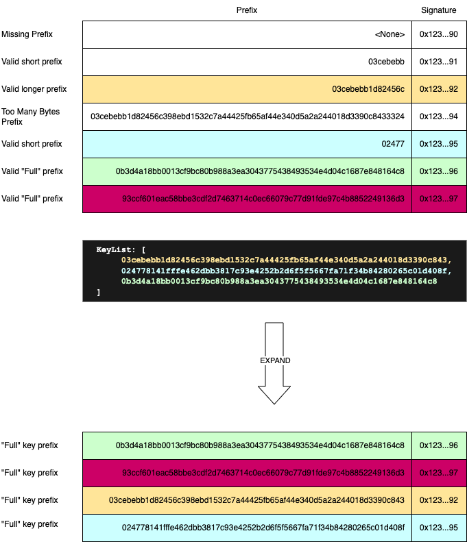

# Signature Verification

Transactions sent to the network are _signed_ by one or more cryptographic keys to assert authorization for the
transaction. The signature is a cryptographic proof that the transaction was authorized by the owner of the
cryptographic key. Hedera supports ED25519 and ECDSA(secp256k1) cryptographic keys. In addition, Hedera supports
compound keys, known as _multi-sig_. Multi-sig keys are a collection of keys that are required to sign a
transaction. Hedera supports both the `KeyList` and `ThresholdKey` multi-sig key types. A `KeyList` is a collection of
keys, all of which must sign to "activate" the key. A `ThresholdKey` is a collection of keys, a minimum number of which
must sign to "activate" the key. Both `KeyList` and  `ThresholdKey` can be nested, allowing for arbitrarily complex
multi-sig schemes.

When transactions are sent to the network, they contain the signatures, and they contain the signed bytes. But that
alone is not sufficient information to know which signature applies to which key. For this reason, the transaction
doesn't just contain the signatures, but actually a "signature map", or _sigmap_ for short. This map is actually
represented in the protobuf as a list of `SignaturePair` objects. Each `SignaturePair` contains a public key prefix,
the type of key, and the signature. When authenticating a transaction, the network will look for the signature that
best matches a cryptographic key that may have be used to sign the transaction, and then verifies the correctness of
that signature.

The sender may also send additional signatures beyond those required to authorize the transaction. In most cases, these
are meaningless, and cost the _payer_ for no benefit. However, some services such as the Smart Contract Service do
currently require the ability to look up signatures not known from the transaction details themselves. For this reason,
we will also verify any signature where the public key prefix is a "full" key, meaning it is the entire public key.
In the case of an ED25519, a full key is 32 bytes long. For ECDSA(secp256k1) a full key is 33 bytes long, the
canonical "compressed" form for that key.

The sender *must not* send a signature map with multiple `SignaturePair`s with identical prefixes, nor with any two
pairs where the prefix of one is the prefix of another. This rule is asserted while syntactically checking the
transaction.

Signature verification is broken down in the following steps:
1. Based on the transaction and the current state of the system, determine the set of keys that are required to sign
   the transaction.
2. Given a _sigmap_ a set of keys, _expand_ the `SignaturePairs` from prefixes to full keys, filtering out any
   signatures that don't have a corresponding key and are not "full" keys already.
3. Verify the signatures and keys are valid for the given transaction bytes

Each of these steps is executed as part of the pre-handle workflow. Indeed, one of the main reasons for having a
pre-handle workflow is to asynchronously verify signatures! We do not know at the end of pre-handle whether all
signatures matched, but we also don't know for sure which of the signatures supplied *must* match for the transaction
to be valid. It is possible that the signing requirements change between pre-handle and handle if the keys on impacted
accounts were modified between the time of pre-handle and handle.

